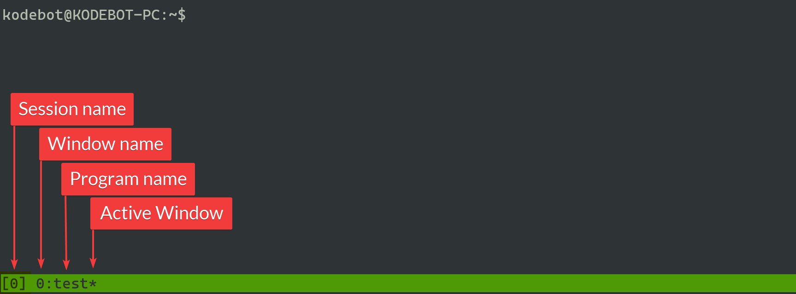

### What is tmux?
`tmux` is terminal multiplexer that allows your terminal to be split into different sessions, windows and panes. One of the great thing about `tmux` session is that it allows you to detach and reattach to the sessions with terminating the programs running in the sessions.


**Session** - is a wrapper for your windows and panes that you can create, detach from and reattach to without terminating the programs running in the sessions

{}
It is obvious but just so it is clear, you will lose the sessions and programs running in those sessions on reboot.
{}

**Window** - is like tabs within a session, you can switch between them but you can only see one window at a time by default

**Pane** - is a region in the window. By default each with comes with 1 pane. You can add additional horizontal and/or vertical panes as you like



### One minute guide

#### Install
```
sudo apt install tmux
```

#### Create session (default)
```
tmux
```

#### Create session with a name
```
tmux new -s <session-name>
```

#### Frequently used commands

| Command | What it does? |
| ------- | ------------- |
|Press `Ctrl + b` then press `c` immediately|Creates new window|
|Press `Ctrl + b` then press `<window-number>` immediately|Switch between windows. For example, `Ctrl + b` then `1` to switch to window 1|
|Press `Ctrl + b` then press `,` immediately|Allows you to change name of the window|
|Press `Ctrl + b` then press `"` immediately|Splits the screen vertically [-] by creating a new pane|
|Press `Ctrl + b` then press `%` immediately|Splits the screen horizontally [ l ] by creating a new pane|
|Press `Ctrl + b` then press `<arrow-key>` immediately|Switching between panes. Takes you to the pane in present in the direction of the arrow key you pressed|
|Press and hold `Ctrl + b` then press `<arrow-key>`|Resize pane. Changes the size of the pane based on the arrow key you press|
|Press `Ctrl + b` then press `d` immediately|Detach from current session|
|`tmux ls`|List tmux sessions|
|`tmux attach-session -t <session-name>`|Attach to existing session. For example, `tmux attach-session -t 0` attaches to session 0|
|`tmux rename-session -t <session-name> <new-session-name>`|Rename session. For example, `tmux rename-session -t 0 git` renames session 0 to git|
|`exit`|Closes pane, window or a session depending on the context|